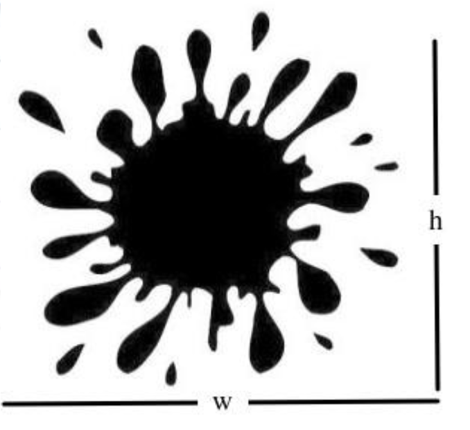

# Question 3 - Section 1

### Statement: 
Suppose that you need to estimate the area of the stain for the following binary image:



A way to do that is the following:

* Generate n random 2D points inside the whole image.
* Count the number of random points which fell inside the stain (ni)

### Question:
Create a pseudocode routine that solves that problem. Additionally, create a simple Angular application that shows an interface to upload a binary image like the previous image and compute the area of the stain immediately after finishing the image upload (follows the proposed method).

### Solution

In terms of the pseudocode, we need a function that:

1. Receives a binary image as input.
2. Randomly decide the amount of n points to be generated.
3. Count the points in the stain
4. Calculate the area.

Considering that the stain area will be more accurate when n tends to infinite. As an improvement to the previous steps, the pseudocode will repeat the process 10 times and average the areas calculated at each repetition.

For this exercise it is assumed that the image is received as a 2D array where each position of the given array is also an array.

```Java
function getArea(image : integer_2d_array)
    integer repeat = 10
    integer height = size_of(image)
    integer width = size_of(image[0])
    double average_area = 0
    loop (for integer r from o to 0)
        double area = 0
        integer n = get_random(from 0 to height*width)
        loop ( for integer seed from 0 to n ) 
            integer x = get_random(from 0 to height*width)
            integer y = get_random(from 0 to height*width)
            if image[x][y] == 1 then
                area = area + 1
            end_if
        end_loop
        area = area/(height*width)
        average_area = average_area + area
    end_loop
    average_area = average_area/repeat
    return average_area
```