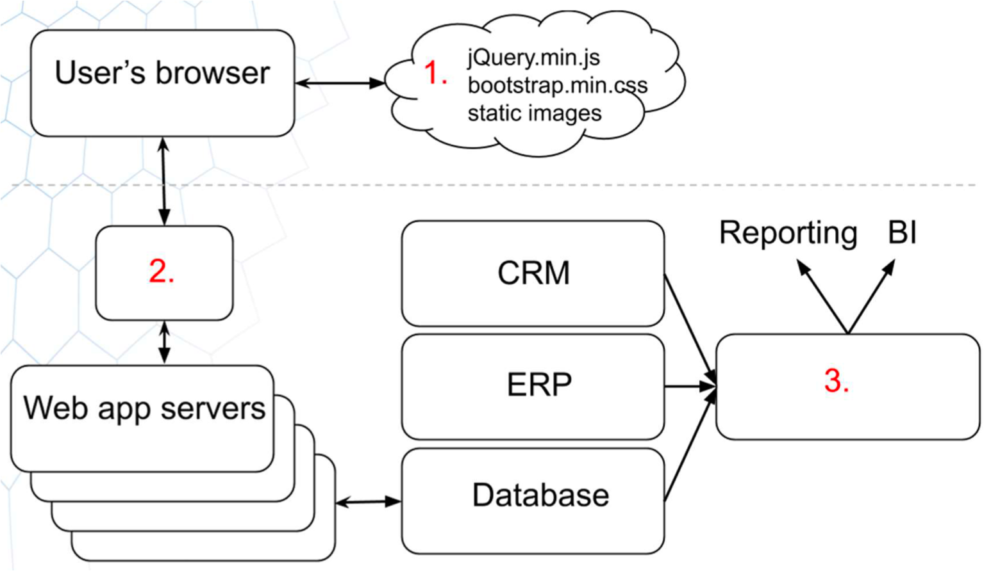

# Question 4 - Section 2

### Statement: 
Someone proposed the following architecture during a brainstorm:

### Question:
The authors of the diagram forgot to write the descriptions for three components marked with red color. Suggests its name and a description for each of the forgotten items. Try to be as accurate as possible.

### Solution

1. CDN: This module is in charge of providing the content that the user views in their web browser. It is basically a group of globally distributed servers that hold/store and deliver the content of the web app. Among the different features of any CDN:
    * It increases the availability of the web app.
    * It can isolate hazardous requests, meaning that can provide extra security. For instance, this can be configured to provide DDoS protection
As illustrated in the image, the CDN cache can help serving CDN cache such as static images, javascript for interaction with the web app, and CSS content to control how the web app looks.
2. Load balancer: This module is in charge of distributing in an efficient manner the incoming network traffic to the web app servers. The web app servers are often grouped into the so-called server pools or farms. This ensures that all servers receive requests in such a way that speed and capacity utilization are optimized. 
3. Data warehouse: This module is basically in charge of providing a bridge between the data collection sources and the bussiness intelligence, storing company's valuable data. In terms of architecture, ETL engines can retrieve data from sources such as CRM, ERP, APIs, etc., and integrate the organized data into a data warehouse. Connecting to a BI module is really useful in termms of generating bussiness insights, providing data visualization and reports.